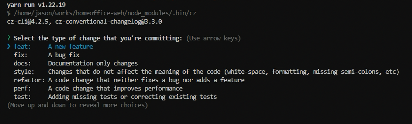

# Git Workflow

This is an overview of the source control management workflow. This repository follows the [trunk based development](https://trunkbaseddevelopment.com/) branching model.

---

## Branch Naming Conventions

Before making updates, create a new branch to do your work.

Branches are named `<subapp-name>/<category>/<tracker-number>`

Be sure to use [`kebab-case`](https://medium.com/javascript-in-plain-english/convert-string-to-different-case-styles-snake-kebab-camel-and-pascal-case-in-javascript-da724b7220d7) in the subapp name and feature description.

Examples:

- core/doc/MECOE-1711
- chatbot/feat/JIRA-123

### Subapp name

Subapp name is located in front of the branch name. Use `core` or mini app name here.

### Category

Use one of the next defined values:

- `feat` for creating or improving a feature.
- `bug` for fixing a bug in an existing feature.
- `test` for adding tests or improving test coverage.
- `chore` for updating tasks that have no production code change.
- `doc` for improving READMEs or other Markdown documents.
- `junk` for experimental features not to be merged.

### Tracker Number

This is the Jira ticket number assigned to the feature or bug for the branch.

### Description

This is the short description for the branch.

---

## Commit Messages

We've integrated ESLint, Prettier, Commitizen and Husky git hooks, to ensure our codebase is consistent and easy to work with.

### Commitizen

Commitizen is a tool that is useful in helping to ensure that git commit messages are formatted in a consistent way.
An interactive prompt will guide you through the authoring of the commit message.

Simply use `yarn cz` instead of git commit when committing.

[](./images/add-commit.png)

### Husky

Husky is a great tool for configuring git hooks, which can automatically lint code and commit messages, run unit tests (and so much more) before you push to a remote repository. This helps to ensure no bad code gets into the repository because someone forgot to manually run the lint or test commands manually first.

There are 3 husky hooks we defined:

- `commit-msg`

  This hook is called after the user enters a commit message. We configured this hook so it will ask [commitlint](https://github.com/conventional-changelog/commitlint) to lint our commit message. To test this works in a terminal, we simply change a file, and try to commit it with a non conventional commit message.

  ```
  $ git add .
  $ git commit -m "Set up Husky and commitlint"
  ```

  The operation should be failed.

  If you run the following commit instead it should work:

  ```
  $ git commit -m 'feat: set up husky and commitlint'
  ```

- `pre-commit`

  It wires up the Husky pre-commit hook to call `lint-staged`. When we have any ESLint errors, or Prettier formatting issues in our staged files (and we didn't use IDE extensions to automatically reformat on file save etc), then before the commit task runs, our files will checked and automatically fixed if possible.

- `pre-push`

  This hook is called when you try to execute `git push`. It's configured to run `nx affected:test`, if test command fails, your push will be automatically aborted.

---

## Rebase before you make the PR, if needed

Unless there is a good reason not to rebase - typically because more than one person has been working on the branch - it is often a good idea to rebase your branch to tidy up before submitting the PR.

```
$ git pull --rebase origin main
```

---

## Creating a Pull Request

### PR Title

Please format the title as follows: `<type>(<subapp-name>): <short description> - <tracker-number>`

Example:

```
doc(core): add pr standards - MECOE-1711
```

`Type`

The allowed types follow the [conventional-changelog](https://github.com/conventional-changelog/commitlint/tree/master/@commitlint/config-conventional#type-enum) standard.

### Request Review

- Assign more than 2 team members as the reviewer.
- If your PR affects [core](../apps/core/) files, you should add a member of desktop core team.

### Merging a Pull Request

When a pull request you submitted has received one or more +1 comments and its tests all pass, it's ready to merge into master.

- Squash commits when merging
- Make sure feature branch is deleted after merge
